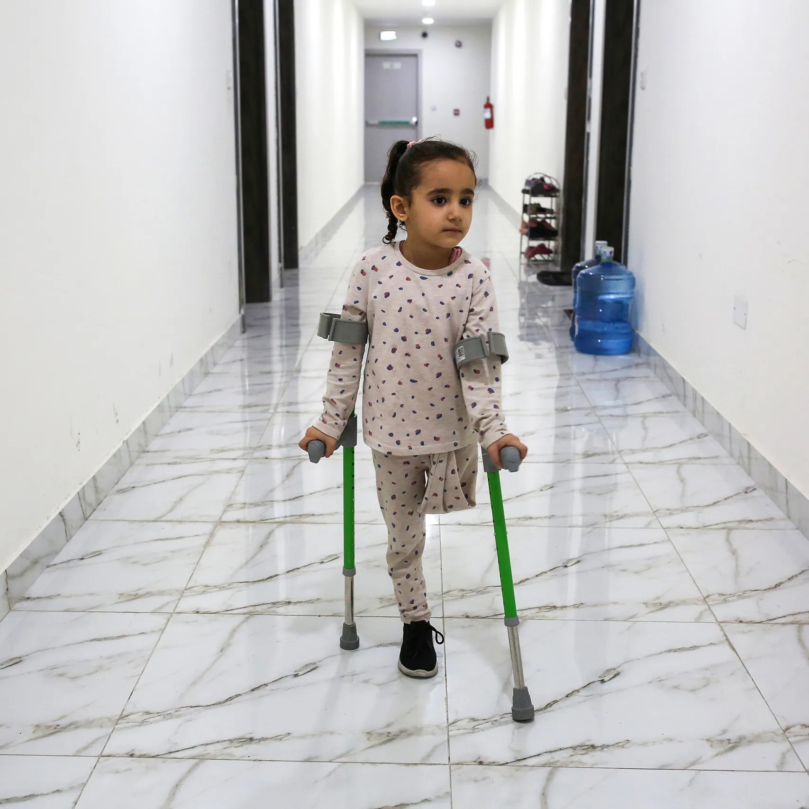
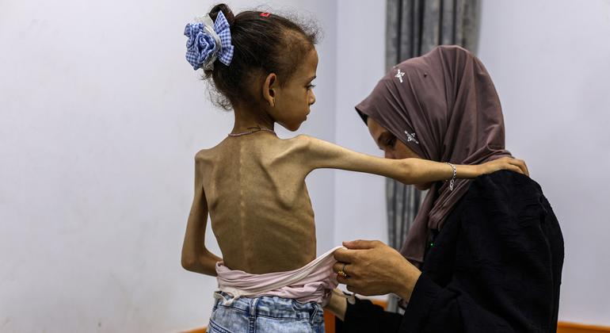

<!DOCTYPE html>
<html lang="en">
<head>
  <meta charset="UTF-8">
  <meta name="viewport" content="width=device-width, initial-scale=1">
  <title>Break the Siege, Save Lives</title>
  
</head>
<body>
  <header>
    <h1>Break the Siege, Save Lives</h1>
    

      <button onclick="setLanguage('en')">ENGLISH</button>
      <button onclick="setLanguage('de')">DEUTSCH</button>
    

  </header>

  <nav>
    <button onclick="showTab('about')">ABOUT</button>
    <button onclick="showTab('getinvolved')">GET INVOLVED</button>
  </nav>

  <!-- ABOUT TAB -->
  

    
    

      <h2>WHO WE ARE</h2>
      

        We are everyday people who believe in peace and safety for everyone, children above all. We are independent, international, and unaffiliated with any government or political party.
        Our aim is peace and protection of human lives.
        The siege and childslaughter must end.
      

    

  

  <!-- GET INVOLVED TAB -->
  

    
    

      

        As a result of the Gaza war, children have been disproportionately impacted in the Gaza Strip, where 40% of the population is 14 or under. More than 700,000 children in Gaza were displaced. UN Secretary General Antonio Guterres warned that "Gaza is becoming a graveyard for children. Hundreds of girls and boys are reportedly being killed or injured every day". More than 50,000 children had been killed or injured in Gaza. In late September 2024, Oxfam and Action on Armed Violence reported that the number of children killed in Gaza over the past year was the highest recorded in a single year for any conflict worldwide in the last 20 years.
      

      

        <h3>HOW YOU CAN HELP</h3>
        

          - Contact your representatives and demand immediate ceasefire 
          - Spread awareness about the humanitarian crisis 
          - Advocate for children's rights and protection
        

        

          <a href="https://twitter.com/intent/tweet?text=Break%20the%20Siege%2C%20Save%20Lives%20%23Gaza" target="_blank">Share on Twitter</a>
          <a href="https://www.instagram.com" target="_blank">Share on Instagram</a>
          <a href="#">More...</a>
        

      

    

  

  <script>
    const translations = {
      en: {
        about: {
          title: "WHO WE ARE",
          text: `We are everyday people who believe in peace and safety for everyone, children above all. We are independent, international, and unaffiliated with any government or political party.
          Our aim is peace and protection of human lives.
          The siege and childslaughter must end.`
        },
        getinvolved: {
          text: `As a result of the Gaza war, children have been disproportionately impacted in the Gaza Strip, where 40% of the population is 14 or under. More than 700,000 children in Gaza were displaced. UN Secretary General Antonio Guterres warned that "Gaza is becoming a graveyard for children. Hundreds of girls and boys are reportedly being killed or injured every day". More than 50,000 children had been killed or injured in Gaza. In late September 2024, Oxfam and Action on Armed Violence reported that the number of children killed in Gaza over the past year was the highest recorded in a single year for any conflict worldwide in the last 20 years.`,
          helpTitle: "HOW YOU CAN HELP",
          helpPoints: `- Contact your representatives and demand immediate ceasefire 
          - Spread awareness about the humanitarian crisis 
          - Advocate for children's rights and protection`
        }
      },
      de: {
        about: {
          title: "WER WIR SIND",
          text: `Wir sind gewöhnliche Menschen, die an Frieden und Sicherheit für alle glauben, vor allem für Kinder. Wir sind unabhängig, international und keiner Regierung oder politischen Partei zugehörig.
          Unser Ziel ist Frieden und der Schutz menschlichen Lebens.
          Die Belagerung und das Töten von Kindern müssen aufhören.`
        },
        getinvolved: {
          text: `Infolge des Krieges in Gaza sind Kinder im Gazastreifen überproportional betroffen, wo 40 % der Bevölkerung unter 14 Jahre alt sind. Über 700.000 Kinder in Gaza wurden vertrieben. UN-Generalsekretär António Guterres warnte, dass "Gaza zu einem Friedhof für Kinder wird. Hunderte Mädchen und Jungen sollen täglich getötet oder verletzt werden". Über 50.000 Kinder wurden in Gaza getötet oder verletzt. Ende September 2024 berichteten Oxfam und Action on Armed Violence, dass die Zahl der im letzten Jahr in Gaza getöteten Kinder die höchste in einem einzigen Jahr für jeden Konflikt weltweit in den letzten 20 Jahren war.`,
          helpTitle: "WIE SIE HELFEN KÖNNEN",
          helpPoints: `- Kontaktieren Sie Ihre Abgeordneten und fordern Sie einen sofortigen Waffenstillstand 
          - Verbreiten Sie Informationen über die humanitäre Krise 
          - Setzen Sie sich für Kinderrechte und Schutz ein`
        }
      }
    };

    function showTab(tabName) {
      document.querySelectorAll('.tab-content').forEach(tab => {
        tab.classList.remove('active');
      });
      document.getElementById(tabName).classList.add('active');
    }

    function setLanguage(lang) {
      const aboutText = document.getElementById('about-text');
      const getInvolvedText = document.getElementById('getinvolved-text');

      aboutText.innerHTML = `
        <h
